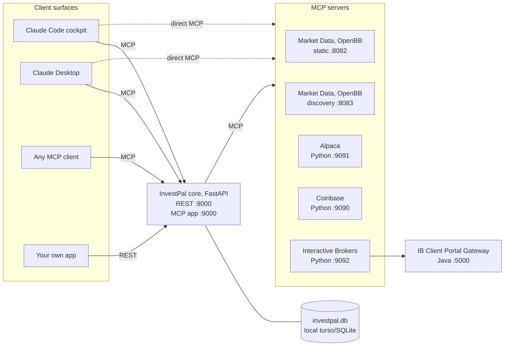

# Architecture

InvestPal is a handful of small services that run on your own machine. There is no hosted backend, no
account and no tenancy. Everything is reachable on localhost, and all state lives in one local
turso/SQLite file.

## The shape of it

Solid lines are the normal path. The dotted lines matter: **Claude Code and Claude Desktop connect
to the market data and brokerage servers directly**, as native MCP clients, rather than going
through the REST layer. The core orchestrates those servers only on behalf of clients that cannot
speak MCP themselves.

Market data is two processes of the same OpenBB build because the setting that separates them is
server-wide. The core reaches the static instance on 8082, which has a fixed set of around 153
tools always enabled. Claude Code and Claude Desktop reach the discovery instance on 8083, which
starts with everything disabled and lets a client switch categories on within its own session.
The core cannot use discovery: it opens a fresh MCP session per tool call and binds its tool list
when the agent is constructed. See [Market data](market-data.md).

## Services

| Service | Language | Port | Repository |
|---|---|---|---|
| InvestPal core (REST API + MCP app) | Python, FastAPI | 8000 / 9000 | [InvestPal](https://github.com/OrestisStefanou/InvestPal) |
| Market Data, static | Python, OpenBB | 8082 | [OpenBB](https://github.com/OpenBB-finance/OpenBB), pinned venv at `.venvs/openbb` |
| Market Data, discovery | Python, OpenBB | 8083 | Same build, `--tool-discovery` |
| Alpaca MCP server | Python, FastMCP | 9091 | [AlpacaMcpServer](https://github.com/OrestisStefanou/AlpacaMcpServer) |
| Coinbase MCP server | Python, FastMCP | 9090 | [CoinbaseMcpServer](https://github.com/OrestisStefanou/CoinbaseMcpServer) |
| Interactive Brokers MCP server | Python, FastMCP | 9092 | [InteractiveBrokersMcpServer](https://github.com/OrestisStefanou/InteractiveBrokersMcpServer) |
| IB Client Portal Gateway | Java | 5000 | Interactive Brokers' own gateway, started only if installed |

The three brokerage servers are optional. InvestPal is fully functional as a research tool on
market data alone. The discovery market-data instance is optional too: only the Claude clients
use it, so `make start` warns rather than aborting if it fails. The static one is required.

See [Service Overview](../README.md#service-overview) in the README for startup order and health
gating.

## Agents

Three distinct agents run inside the core, each built with `langchain.agents.create_agent` and
given tools over MCP through `MultiServerMCPClient`.

| Agent | Role |
|---|---|
| `InvestmentManagerAgent` | The user-facing advisor. Holds the persona, reaches for skills, calls the market data and brokerage tools. |
| `UserContextMemoryManagerAgent` | Maintains long-term memory in the background, on a cheaper model, so the conversation is never interrupted to take notes. |
| `WorkflowExecutionAgent` | Non-conversational. Runs scheduled workflows when they come due and stores the report. |

The provider and model are set per agent in `.env`. Note that these apply to InvestPal's own
backend agent only: in the Claude Code cockpit, Claude Code itself is the model and no API key is
involved.

## Where state lives

Everything is in a single turso/SQLite file at `TURSO_DB_PATH`, created on first start. No database
server is required.

| Data | Notes |
|---|---|
| User profile notes | What the advisor knows about you, superseded rather than deleted |
| Conversation notes | Searchable by meaning, not just keyword |
| Note embeddings | 384-dimension vectors from `BAAI/bge-small-en-v1.5`, computed locally on CPU via fastembed. Note text is never sent anywhere to produce them. |
| Reminders | Action items the advisor tracks for you |
| Workflows and results | Cron expression, `last_run_at`, `next_run_at`, running lock, and every stored report |
| Sessions and messages | Conversation history |

Brokerage credentials are **not** stored here. `.env.secrets` holds them at mode 600 and is
denied to the Claude Code agent by the `permissions.deny` rules in `.claude/settings.json`.
`scripts/lib.sh` hands each one to its own broker MCP server at start time and to nothing else,
so a credential exists in exactly one process and never travels over an MCP connection. A broker
server started without its credentials comes up healthy and registers no tools.

Turso Cloud sync is optional and entirely manual. Nothing syncs on startup, on shutdown, or on a
timer. See [Turso Cloud sync](../README.md#turso-cloud-sync).

## Tool surface

| Server | Tools | Reference |
|---|---|---|
| InvestPal MCP app | 26 tools plus one prompt: profile, memory, reminders, workflows, skills, utility | [`InvestPal/docs/mcp_api.md`](https://github.com/OrestisStefanou/InvestPal/blob/main/docs/mcp_api.md) |
| Market Data, static (8082) | ~153 tools across equity, etf, crypto, currency, economy, news, index, commodity and regulators. Most work with no key | [Market data](market-data.md) |
| Market Data, discovery (8083) | ~6 admin tools, all 287 reachable per session | [Market data](market-data.md) |
| Alpaca | 6 tools; the order-placing tool is hidden when `ALPACA_READ_ONLY=true` | [AlpacaMcpServer README](https://github.com/OrestisStefanou/AlpacaMcpServer#readme) |
| Coinbase | 5 tools; same read-only switch | [CoinbaseMcpServer README](https://github.com/OrestisStefanou/CoinbaseMcpServer#readme) |
| Interactive Brokers | 14 tools; the three write tools disappear under `IB_READ_ONLY=true` | [InteractiveBrokersMcpServer README](https://github.com/OrestisStefanou/InteractiveBrokersMcpServer#readme) |

The REST API is documented at `http://localhost:8000/docs` once the services are running, and in
[`InvestPal/docs/rest_api.md`](https://github.com/OrestisStefanou/InvestPal/blob/main/docs/rest_api.md).

## Order safety

Worth stating plainly, because it is the part with real money attached.

- Alpaca points at the paper endpoint by default. Live trading needs an explicit
  `ALPACA_API_BASE_URL` override.
- `ALPACA_READ_ONLY`, `COINBASE_READ_ONLY` and `IB_READ_ONLY` each hide the order-placing tools
  from the advisor entirely, so it can read a portfolio but cannot act on it.
- Interactive Brokers never accepts a trading warning on your behalf. `placeOrder` returns
  `status: NEEDS_CONFIRMATION` with a `reply_id` and the warning text, and the order stays off the
  market until `confirmOrder` is called. Acceptance is not cancellation.

## Data sources

OpenBB fronts 32 providers. No paid subscription is required, and no data leaves the machine
except the provider requests themselves.

| Source | Used for | Key |
|---|---|---|
| Yahoo Finance (`yfinance`) | Prices, quotes, financial statements, key metrics, company news | none |
| SEC EDGAR (`sec`) | Filings, financial statements, Form 4 insider trading, Form 13F holdings, MD&A | none |
| Federal Reserve | Treasury rates, yield curve | none |
| European Central Bank | Euro reference rates, euro-area yield curve | none |
| IMF, OECD | International macro, CPI, country indicators | none |
| Finviz, Cboe, FINRA, TMX, Seeking Alpha | Screeners, options, short interest, ETF holdings, earnings calendar | none |
| **FRED** | Commodity spot prices, most Federal Reserve series | free, registration only, and in practice required |
| Financial Modeling Prep | Ratios, worldwide news, analyst estimates, peer comparison, segment revenue | free tier, 250 req/day |

The full tier-by-tier list, what each key unlocks, and how to set one:
[Market data](market-data.md).

## Related

- [Market data](market-data.md), the OpenBB instances and their providers
- [Skills](skills.md), the fifteen analytical procedures the advisor follows
- [Claude Code cockpit](claude-code-cockpit.md)
- [Claude Desktop](claude-desktop.md)
- [The local web UI](web-ui.md)
- [Custom UI over the REST API](custom-ui.md)
